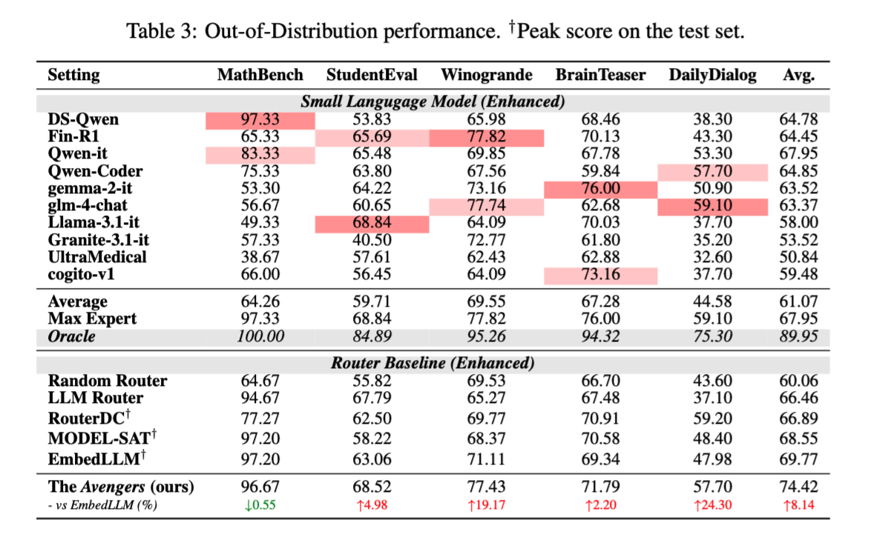

<div align="center">

</div>

<h1 align="center">The Avengers: A Simple Recipe for Uniting Smaller Language Models to Challenge Proprietary Giants</h1>

<div align="center">

[](https://arxiv.org/abs/2505.19797)
[](https://huggingface.co/datasets/Estwld/Avengers)
[](LICENSE)
[](https://www.python.org/)

</div>


## Abstract
<div align="center">

<p><em><strong>Figure 1:</strong> Comparison of proprietary models with our method (the Avengers) across six representative
benchmarks. Full results on all 15 benchmarks are reported in Table 2</em></p>
</div>

The *Avengers* is a simple recipe that effectively leverages the *collective intelligence* of open-source, smaller language models. 
Remarkably, **with 10 open-source models (∼7B parameters each), the Avengers surpasses GPT-4o, 4.1, and 4.5 in average performance across 15 diverse datasets spanning mathematics, coding, logical reasoning, general knowledge, and affective tasks**. 
As of May 2025, with 10 open-source models (～7B parameters each), the *Avengers* collectively outperforms GPT-4.1 (OpenAI’s flagship model released on April 14, 2025) on 9 out of 15 representative datasets.

## What is New
[2025-12-10] 🎉 OpenRouterBench - We have open source all data into OpenRouterBench ([huggingface](https://huggingface.co/datasets/NPULH/OpenRouterBench), [GitHub](https://github.com/ynulihao/OpenRouterBench))

[2025-11-08] 🎉 AAAI 2026 (Oral) — Our paper was accepted as an Oral presentation at AAAI 2026.

## Highlights

- No neural network training, no hand-crafted prompts or system architecture design
- Require only 1 parameter: the number of clusters
- Support automatic model selection and on-the-fly new model integration
- Robust to various embedding models, clustering algorithms, and ensemble strategies
- Comprehensive evaluation across 15 benchmarks covering 5 domains

<div align="center">

<p><em><strong>Table 1:</strong> Methodological comparison between baseline methods and the Avengers</em></p>
</div>

**Key advantages of The Avengers**: Unlike other ensemble methods, The Avengers requires **no training**, introduces **no additional parameters**, eliminates the need for designing **model collaboration structures**, and requires **no specialized prompt engineering**. This makes our approach uniquely lightweight and practical for real-world deployment.

## Results

<div align="center">

<p><em><strong>Table 2:</strong> Main Results</em></p>
</div>

**Outstanding performance**: Using approximately **10 models with ~7B parameters each**, The Avengers achieves superior performance compared to GPT-4.1 on **10 out of 15 datasets**, while also surpassing GPT-4.1 in **average performance across all 15 datasets**. When compared with baseline router- and mixture-based methods, The Avengers consistently delivers the best results across benchmarks.

<div align="center">

<p><em><strong>Table 3:</strong> Out-of-distribution results</em></p>
</div>

**Superior generalization**: Compared to routing-based methods, The Avengers demonstrates the **best out-of-distribution (OOD) performance** thanks to its training-free nature, which prevents overfitting to specific datasets and ensures robust generalization to unseen domains.

<div align="center">

<p><em><strong>Table 4-6:</strong> Ablation studies.</em></p>
</div>

<div align="center">
<table border="0">
<tr>
    <td>
        
        <p><em><strong>Figure 2:</strong> Impact of selected models' number.</em></p>
    </td>
    <td>
        
        <p><em><strong>Figure 3:</strong> Impact of cluster count K</em></p>
    </td>
</tr>
</table>
</div>

**Robust to design choices**: Ablation studies demonstrate that The Avengers is insensitive to the choice of embedding models, clustering methods (14<K<140), and model selection. With 22 models tested, our automatic model selection based on cluster ranking (scoring) achieves peak performance with ~10 models, while using only 3 models matches GPT-4.1's average performance. Among different ensemble strategies, *Self-Consistency* shows the best performance.

## Getting Started

### Prerequisites

- Python 3.12+
- Required dependencies (see `requirements.txt`)

### Installation

```bash
# Clone the repository
git clone https://github.com/ZhangYiqun018/Avengers.git
cd Avengers

# Install dependencies
pip install -r requirements.txt
```

### Usage

For detailed usage instructions, please refer to our comprehensive [Usage Guide](USAGE.md).

**Quick Start:**

```bash
# Clone the repository
git clone https://github.com/ZhangYiqun018/Avengers.git
cd Avengers

# Install dependencies
pip install -r requirements.txt

# Configure your models (copy and edit the template)
cp config/experts_template.yaml config/my_config.yaml

# Run a simple experiment
python app.py --config config/my_config.yaml --save_dir results/
```

**Key Features:**
- Support for 15 evaluation benchmarks across 5 domains
- Multiple routing strategies (straight, random, rank-based, GPT-based)
- Various generation methods (direct, self-consistency, fast-slow)
- Built-in HTTP caching for API optimization
- Parallel processing support

## Evaluation Benchmarks

Our method has been comprehensively evaluated across multiple categories:

| **Category** | **Benchmarks** |
|------------|----------------|
| Mathematics | AIME, Math500, LiveMathBench, *MathBench* |
| Code | MBPP, HumanEval, *StudentEval* |
| Logic | KORBench, Knights and Knaves, BBH, *Winogrande* |
| Knowledge | MMLUPro, GPQA, FinQA, MedQA, ARCC, *BrainTeaser* |
| Affective | EmoryNLP, MELD, *DailyDialog* |

*Note: Datasets in italics are used as out-of-distribution datasets in our paper.*


## Dataset

**Access to evaluation datasets**: [Avengers on HuggingFace](https://huggingface.co/datasets/Estwld/Avengers)

## Implementation Details

For researchers and developers interested in the technical implementation:

### 🔧 Rank Router Implementation
- **Automated Generation**: [`core/generate_rank_router.py`](core/generate_rank_router.py) - Complete pipeline for generating rank router artifacts
- **Ablation Studies**: [`core/ablation_experiments.py`](core/ablation_experiments.py) - Comprehensive framework for ablation experiments
- **Documentation**: 
  - [English Documentation](core/README_rank_router_EN.md) - Detailed implementation guide
  - [中文文档](core/README_rank_router_CN.md) - 详细实现指南

### 🧪 Experimental Framework
The `core/` directory contains the complete implementation of our clustering-based routing system, including:

- **K-means sensitivity analysis** - Impact of cluster numbers on performance
- **Clustering method comparison** - K-means vs. hierarchical vs. GMM vs. others
- **Model selection strategies** - Automated selection of optimal model combinations
- **Embedding model evaluation** - Support for multiple embedding models

### 🚀 Quick Start for Developers
```bash
# Generate rank router configuration
python core/generate_rank_router.py --data_path your_data.json --n_clusters 64

# Run comprehensive ablation studies  
python core/ablation_experiments.py --experiment all --data_path your_data.json
```

**Note**: All implementation preserves the core algorithmic logic described in our paper while providing production-ready code with comprehensive error handling, caching, and parallel processing support.

## Citation

If you find our work useful for your research, please consider citing:

```bibtex
@misc{zhang2025avengerssimplerecipeuniting,
      title={The Avengers: A Simple Recipe for Uniting Smaller Language Models to Challenge Proprietary Giants}, 
      author={Yiqun Zhang and Hao Li and Chenxu Wang and Linyao Chen and Qiaosheng Zhang and Peng Ye and Shi Feng and Daling Wang and Zhen Wang and Xinrun Wang and Jia Xu and Lei Bai and Wanli Ouyang and Shuyue Hu},
      year={2025},
      eprint={2505.19797},
      archivePrefix={arXiv},
      primaryClass={cs.CL},
      url={https://arxiv.org/abs/2505.19797}, 
}
```

## Contact

For questions or collaborations, please contact: [yiqunzhang@stumail.neu.edu.cn](mailto:yiqunzhang@stumail.neu.edu.cn) or [li.hao@mail.nwpu.edu.cn](mailto:li.hao@mail.nwpu.edu.cn)
